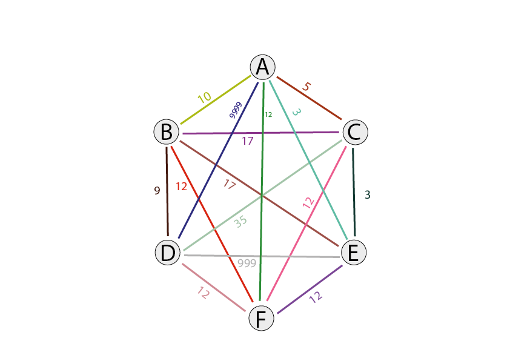

<h1> Pathfinding </h1>

  
  
<h3> Diagram over tilkoblinger </h3>
Diagrammet over beskriver alle mulige tilkoblinger mellom de forskjellige nodene. De er fargekodet slik at fargen på linjen har tilknytting til fargen på tallet og representerer kostnaden for å bevege seg begge veier mellom nodene
